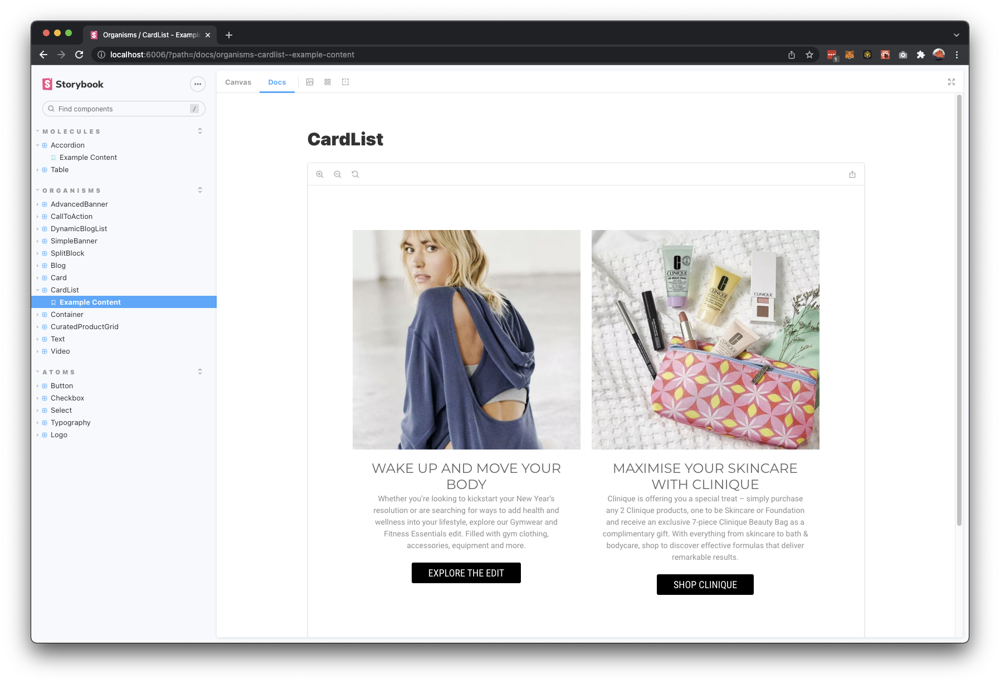

[](https://amplience.com/dynamic-content)

# Amplience Demo Store Core Package

`dc-demostore-core` is a React/Material/NextJS front-end e-Commerce application, implemented with Typescript, showcasing Amplience Dynamic Media and Dynamic Content. 

It uses GraphQL as an integration layer for e-Commerce. What does this mean exactly? it means that <!-- TODO: high level detail -->

The package includes a Debug/X-Ray panel to aid in tracing and analysing requests and payloads, to and from Amplience Content Delivery v2 & Filter API's.

It also includes Storybook, a visual documentation of the UI components, things like Product Lists, Banners, Blogs & Blog posts, Stores, etc.


`dc-demostore-core` is intended for DEMO PURPOSES ONLY, and *not* for production-optimized environments.


# Table of Contents
- [Getting Started](#getting-started)
- [Storybook](#storybook)
- [Provisioning your own Amplience Environment)](#provisioning-your-own-amplience-environment)
- [Additional Topics](#additional-topics)


# Getting Started
## General Use (w/o Amplience account)

Out of the box, `dc-demostore-core` may be used without needing to have an Amplience account, allowing you to experiment with API calls and Front-End customisations against an existing content base. You can simply clone this repository and it already points to a working account so that you can see:

 - Live Content
 - Components
 - Amplience API requests
 - etc.

 The following commands will install `dc-demostore-core` on your local machine.

```sh
$ gh repo clone amplience/dc-demostore-core
$ cd dc-demostore-core
$ yarn install
```

### To run a Development environment:

```sh
$ yarn dev
```

### To run a production environment:

```sh
$ yarn build
$ yarn start
```

Both dev and prod commands will also start a localhost. Then go to [http://localhost:3000](http://localhost:3000)


# Storybook

Firing up Storybook is super simple:

```sh
$ yarn storybook
```

Then go to http://localhost:6006. More details may be found in our [Storybook README](docs/Storybook.md)



<!--

  - OWN README: Own Account: What do you need to configure your own Amplience Instance:
    - What are the dependencies / pre-requisites: Own Sandbox, configure to that
      - Deploy to get APP URL
      - Packages - dc-demostore-CLI etc
      - What account information do you need and where do you get it (hub ID, etc)
      - Pointing the FE to yours - Deployment Variable or Local env variable after automation has run

-->


# Provisioning your own Amplience Environment

The main tool for using your own Amplience environment with `dc-demostore-core` is `dc-demostore-cli`. The CLI tool allows you to quickly import a pre-configured set of Content Schemas, Content Types, Images, etc. to your Amp Env. Basically, everything you'd see running `dc-demostore-core` OOTB against our 'core public' Amplience Environment.

At a high level the basic steps are:

1. [Request an Amplience Media and Dynamic Account (if you don't already have one)](#requesting-an-amplience-environment)
2. [Deploy a fork of `dc-demostore-core` (we'll cover deploying on Vercel)](#fork--deploy-dc-demostore-core)
3. Configure & use `dc-demostore-cli` to populate content
4. Point `dc-demostore-core` to your Dynamic Content Hub and run

## Requesting an Amplience Demo Store Environment

If you already have a Dynamic Content and Dynamic Media instance, you can skip to the [next step](#fork--deploy-dc-demostore-core).

This section assumes you are already an Amplience partner, customer, or internal Amplience team member with access to the Amplience Support Center. IF the answer to any one of these is yes, [go here for instructions on requesting a Demo Store Environment](docs/DemoEnvironmentRequest.md)

## Fork & Deploy `dc-demostore-core`

Go [HERE for some basic instructions](docs/ForkDeploy.md) on Forking and deploying core.

## Configure & Use `dc-demostore-cli`

Please refer directly to the [this README on how to Install/Configure/Use the CLI tool](https://github.com/amplience/dc-demostore-cli)

Once you have installed the `demostore` CLI tool, you can provision your account in two easy steps:

1. Register your instance using the CLI command `env add`

```sh
% demostore env add 
✔ env name: · mydcinstance
✔ app deployment url: · https://mydomain.com
✔ cms client id: · zzzzzzzz-yyyy-yyyy-yyyy-xxxxxxxxxxxx
✔ cms client secret: · ****************************************************************
✔ cms hub id: · xxxxxxxxxxxxxxx
✔ dam username: · youremail@domain.com
✔ dam password: · ********
info: [ amprsatest ] configure dc-cli...
info: [ amprsatest ] environment active
info: run [ env,add ]: started at Mon Mar 28 2022 12:39:21 GMT+0200 (Central European Summer Time)
```

2. You can provision your instance using the CLI command `import` [(more information on the CLI tool project page)](https://github.com/amplience/dc-demostore-cli):

```sh
% demostore import --latest
info: run [ import ]: started at Mon Mar 28 2022 12:45:26 GMT+0200 (Central European Summer Time)
...
...
...
info: run completed in [ 3m20s ]
```

## Change dc-demostore-core Config / Point to your account
- Create a .env.local file on the root of your project:

Default setting:

```sh
NEXT_PUBLIC_DEMOSTORE_CONFIG_LOCATOR=amprsaprod:default
```

Your setting with your Hub Name {hubname}

```sh
NEXT_PUBLIC_DEMOSTORE_CONFIG_LOCATOR={hubname}:default
```


If you are using services like Vercel, you can configure the environment variable in the settings, and re-deploy your application.

[top](#table-of-content)


## Additional Topics
- [Features Highlights](docs/FeatureHiLites.md)
- [High-Level Architecture](docs/ArchDiagram.md)
- [Available Components](docs/Components.md)
- [Exploring features](docs/DeepDive.md)
- [Contribution Model (fork, PR, etc.)](https://github.com/amplience/dc-cli/blob/master/CONTRIBUTING.md)


<!--
### Configuration

#### cms.json

| Option              | Description                                                                                                                                                    |
| ------------------- | -------------------------------------------------------------------------------------------------------------------------------------------------------------- |
| contentApi          | Content delivery API base URL                                                                                                                                  |
| stagingApi          | Staging environment host name                                                                                                                                  |
| defaultPreviewMode  | STAGING or PRODUCTION                                                                                                                                          |
| hubName             | Content Delivery 2 API - hubName to retrieve content from - [finding the hub name](https://docs.amplience.net/development/contentdelivery/readme.html#hubname) |
| productImageHubName | Content Hub where product images are stored                                                                                                                    |
| imageBasePath       | Images base URL                                                                                                                                                |
| contentBaseUri      | Schemas base URL                                                                                                                                              |

[top](#table-of-content)


You can then use the CLI tool demostore from dc-demostore-cli package to register your environment:

```sh
$ demostore env add 
info: run [ env,add ]
✔ env name: · myinstance
✔ app deployment url: · https://mydomain.com
✔ cms client id: · client-id
✔ cms client secret: · *************
✔ cms hub id: · hub-id
✔ dam username: · me@mydomain.com
✔ dam password: · ********
info: [ myinstance ] configure dc-cli...
info: npx @amplience/dc-cli configure --clientId client-id --clientSecret client-secret --hubId hub-id
info: [ myinstance ] environment active
```

Next step is to run the import command and specify the path to dc-demostore-automation:

```sh
$ demostore import --automationDir ../dc-demostore-automation

info: run [ import ]
info: created temp dir: /tmp/demostore/demostore-iSlTD_-OmUyBEJzjYDLzB
info: connected to hub [ automation02 ]
info: connected to dam with user [ rkalfane@amplience.com ]
info: import: Import hub data started at Mon Feb 14 2022 10:34:42 GMT+0100 (Central European Standard Time)
info: 
info: ---------------------------------------------------
info: Phase 1: preparation
info: ---------------------------------------------------
info: 
info: 🗄  contentTypeSchema: [ 72 unarchived ] [ 10 updated ] [ 0 created ]                                                               
info: 🗂  contentTypes: [ 61 unarchived ] [ 36 updated ] [ 0 created ] [ 61 synced ]                                                      
info: 
info: ---------------------------------------------------
info: Phase 2: import/update
info: ---------------------------------------------------
info: 
info: 🔌  extensions: [ 11 created ]                  
exec  apply settings: automation02.test-index                                                                                         
exec  update webhook: Search Index: automation02.test-index / Blog                                                                    
exec  update webhook: Search Index: automation02.test-index / Blog (archived)                                                         
exec  create index: automation02.blog-production                                                                                      
exec  apply settings: automation02.blog-production                                                                                    
exec  update webhook: Search Index: automation02.blog-production / Blog                                                               
exec  update webhook: Search Index: automation02.blog-production / Blog (archived)                                                    
exec  create index: automation02.blog-staging                                                                                         
exec  apply settings: automation02.blog-staging                                                                                       
exec  update webhook: Search Index: automation02.blog-staging / Blog                                                                  
exec  update webhook: Search Index: automation02.blog-staging / Blog (archived)                                                       
info: 🔍  searchIndexes: [ 3 created ] [ 0 replicas created ] [ 6 webhooks created ]       
...
info: 📄  contentItems: [ 143 created ] [ 0 updated ]                                                                              
...
info: 📄  contentItems: [ 143 published ] 
...
info: 
info: ---------------------------------------------------
info: Phase 3: update automation
info: ---------------------------------------------------
info: 
info: 
info: ---------------------------------------------------
info: Phase 4: reentrant import
info: ---------------------------------------------------
info: 
...
info: 🗄  contentTypeSchema: [ 0 unarchived ] [ 9 updated ] [ 0 created ]  
...
info: 🗂  contentTypes: [ 0 unarchived ] [ 35 updated ] [ 0 created ] [ 61 synced ]                                                 
info: logs and temp files stored in /tmp/demostore/demostore-iSlTD_-OmUyBEJzjYDLzB
info: run completed in [ 3m53s ]
```

Using the CLI tool, you can also cleanup a hub (check documentation as it can remove everything):

```sh
$ demostore cleanup -a -c
info: run [ cleanup ]
info: created temp dir: /tmp/demostore/demostore-Ft_z9bMsllZBx8DX1GJ8H
info: connected to hub [ myinstance ]
info: connected to dam with user [ me@mydomain.com ]
info: 📄  contentItems: [ 146 items archived ] [ 19 folders deleted ]                                                                    
info: 📢  webhooks: [ 6 deleted ]                                                                                                  
info: 🔍  searchIndexes: [ 3 deleted ] [ 0 replicas deleted ]                                                                            
info: 🗄  contentTypeSchema: [ 72 archived ]                                                                                        
info: 🔌  extensions: [ 11 deleted ]                                                                                                     
info: 📦  repositories: [ 159 content types unassigned ]                                                                                 
info: 🗂  contentTypes: [ 61 archived ]                                                                                             
info: logs and temp files stored in /tmp/demostore/demostore-Ft_z9bMsllZBx8DX1GJ8H
info: run completed in [ 0m20s ]
```

--> 
  
   
